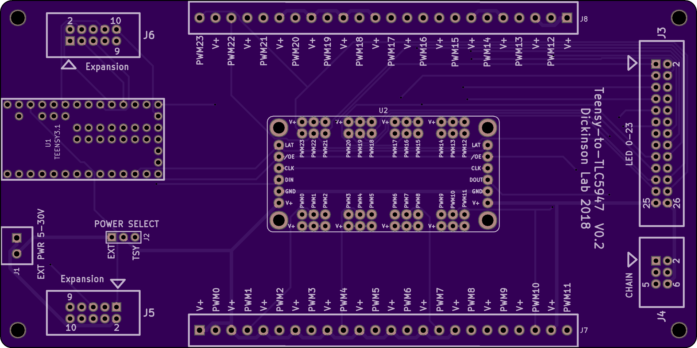

# mcu_to_tlc5947 
A simple PCB for connecting an Arduino (Teensy or Nano) to the Adafruit TLC5947 PWM LED Driver. In progress. 

* [Teensy schematic (PDF)](teensy/mcu_to_tlc5947.pdf)
* [Teensy bill-of-materials](teensy/BOM.txt)

# Top View: 

# Bottom View:

# License: 
Creative Commons Attribution 4.0 International CC BY 4.0
